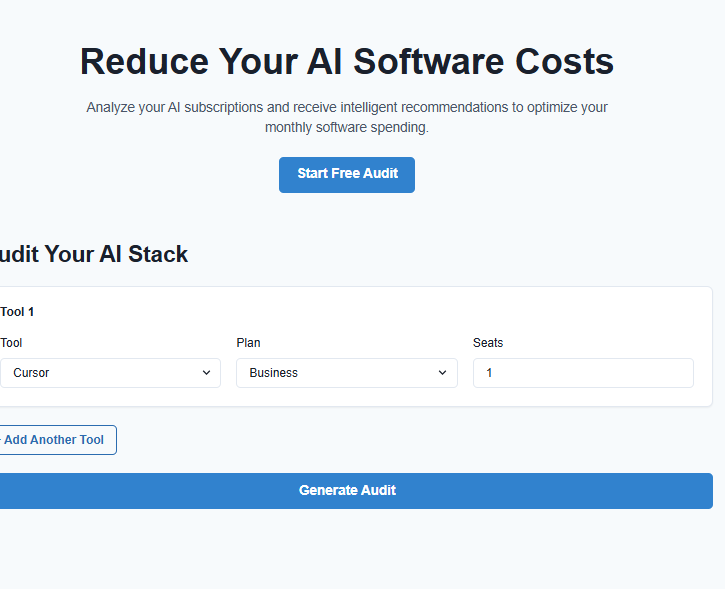
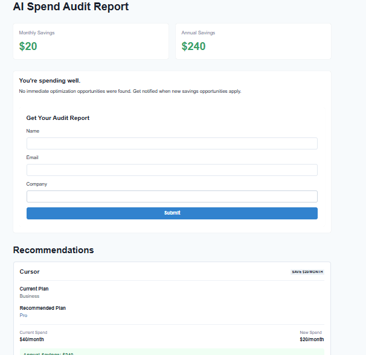
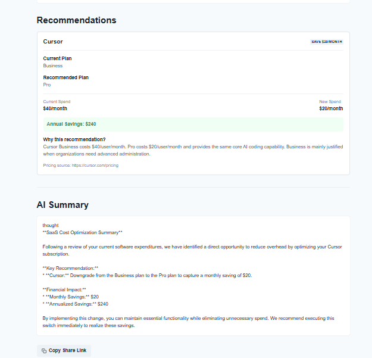
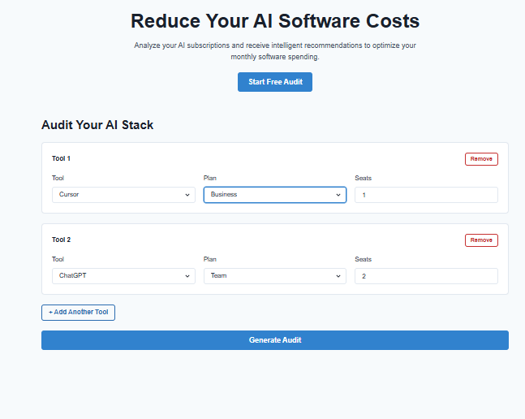
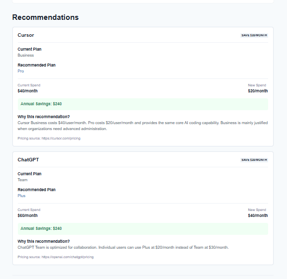

# 🚀 AI Spend Audit

An AI-powered SaaS auditing application that analyzes an organization's AI tool subscriptions, identifies potential cost savings, generates AI-powered optimization recommendations, and allows users to share audit reports.

---

## 🌐 Live Demo

**Frontend:**  
[frontend Live](https://ai-spend-audit-beta-five.vercel.app/)

**Backend API:**  
[backendlive](https://ai-spend-audit-atoq.onrender.com)

---

# 📸 Screenshots

## Home Page



## Result Page



## Recommendation



## Comparison Page



## Comparison Recommendation



# ✨ Features

- Analyze AI tool subscriptions
- Dynamic pricing recommendations
- Monthly & Annual savings calculation
- AI-generated audit summary (OpenRouter AI)
- Save audit reports to Supabase
- Lead capture form
- Shareable audit links
- Responsive UI using Chakra UI
- REST API backend using Express.js

---

# 🛠 Tech Stack

## Frontend

- React (Vite)
- Chakra UI
- React Router DOM
- Axios

## Backend

- Node.js
- Express.js
- Supabase
- OpenRouter AI
- dotenv

---

# 📂 Folder Structure

```
AI-SPEND-AUDIT
│
├── client/
│   ├── src/
│   ├── public/
│   ├── package.json
│   └── vercel.json
│
├── server/
│   ├── src/
│   ├── package.json
│   └── .env
│
└── README.md
```

---

# ⚙️ Installation

## Clone Repository

```bash
git clone https://github.com/Hitesh8980/ai-spend-audit.git
```

---

## Backend Setup

```bash
cd server
npm install
```

Create a `.env`

```env
PORT=7000

SUPABASE_URL=YOUR_SUPABASE_URL
SUPABASE_ANON_KEY=YOUR_SUPABASE_ANON_KEY

OPENROUTER_API_KEY=YOUR_OPENROUTER_API_KEY
```

Run backend

```bash
npm run dev
```

---

## Frontend Setup

```bash
cd client

npm install
```

Create `.env`

```env
VITE_API_URL=http://localhost:7000/api
```

Run

```bash
npm run dev
```

---

# 📡 API Endpoints

## Generate Audit

### POST

```
POST /api/audit
```

Example

```json
{
  "tools": [
    {
      "name": "Cursor",
      "plan": "Business",
      "seats": 2
    }
  ]
}
```

---

## Save Lead

```
POST /api/leads
```

Example

```json
{
  "auditId": "audit-id",
  "email": "john@example.com",
  "company": "ABC Pvt Ltd",
  "role": "Developer",
  "teamSize": 20
}
```

---

## Share Audit

```
GET /api/audit/:id
```

Returns previously generated audit report.

---

# 🧪 How to Test the Application

## Step 1

Open the application.

---

## Step 2

Click **Generate Audit** after selecting one or more AI tools.

---

## Step 3

Try different combinations.

### Example 1

```
Tool : Cursor

Plan : Business

Seats : 2
```

Expected

```
Monthly Savings : $40

Annual Savings : $480
```

---

### Example 2

```
Tool : GitHub Copilot

Plan : Business

Seats : 5
```

Expected

```
Monthly Savings : $45

Annual Savings : $540
```

---

### Example 3

```
Tool : Claude

Plan : Max

Seats : 1
```

Expected

```
Monthly Savings : $80

Annual Savings : $960
```

---

### Example 4

```
Tool : Gemini

Plan : Ultra

Seats : 2
```

Expected

```
Monthly Savings : $460

Annual Savings : $5520
```

---

## Step 4

Review

- Savings
- Recommendations
- AI Summary

---

## Step 5

Fill the Lead Form

Example

```
Email

Company

Role

Team Size
```

Submit successfully.

---

## Step 6

Click **Share Report**

Open the generated URL in another browser tab.

The saved audit should load correctly.

---

# 📌 Future Improvements

- Authentication
- User Dashboard
- Audit History
- PDF Export
- CSV Export
- Charts & Analytics
- Team Management
- Stripe Subscription
- Admin Dashboard

---

# 🚀 Deployment

Frontend

- Vercel

Backend

- Render

Database

- Supabase

---

# 👨‍💻 Author

**Hitesh Sharma**

GitHub

https://github.com/Hitesh8980


---
